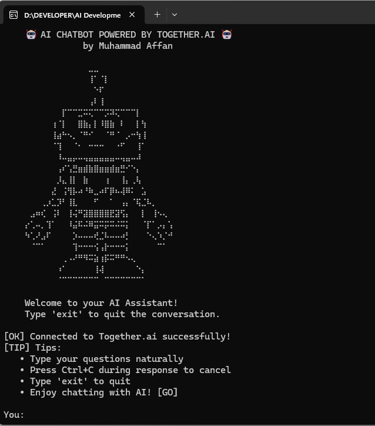

# AI Chatbot - Standalone Executable

A simple command-line AI chatbot powered by Together.ai's Llama 3.2 3B model with real-time streaming and typing effects.



## Features

- 🤖 **AI-powered responses** using Llama 3.2 3B Instruct Turbo (fast and reliable)
- ⚡ **Real-time streaming** with typing effect
- 💻 **Interactive command-line interface**
- 📦 **Standalone executable** - no Python installation required
- 🌍 **Universal compatibility** - works on all Windows systems (with emoji fallback)
- 🎨 **Beautiful ASCII art** - robot welcome screen with fallback for older terminals

## For End Users

### Download and Run

1. Download the `AI_Chatbot.exe` file: https://drive.google.com/file/d/17pBdun8hBG6gCEo1PZuhy4vOXx9Hmz2R/view?usp=sharing
2. **Windows Security Warning**: You may see "Windows protected your PC" warning
   - This is **normal** for unsigned executables
   - Click "More info" → "Run anyway" to proceed
   - All independent developers face this without expensive certificates ($300-800/year)
3. Double-click to run
4. Start chatting with the AI!
5. Type `exit` to quit

### Common Questions

**Q: Why does Windows show a security warning?**
A: This happens because the executable isn't digitally signed. It's completely safe - this affects all unsigned software from independent developers.

**Q: Why does the file size appear larger after download?**
A: Windows adds security metadata during download (~111MB becomes ~117MB). This is normal Windows behavior and doesn't affect functionality.

### Usage

- The chatbot will start with a welcome screen and robot ASCII art
- Emojis and Unicode characters are automatically handled for all systems
- Type your messages and press Enter
- The AI will respond with a realistic typing effect
- Simple and intuitive interface
- Automatic fallback to text versions on older systems

---

## For Developers

### Quick Build (Recommended)

1. **Create a `.env` file with your API key:**
   ```
   TOGETHER_API_KEY=your_api_key_here
   ```

2. **Run the enhanced build script:**
   ```bash
   python build_executable.py
   ```

3. **Find your executable in the `dist/` folder**

### Manual Build

1. **Install dependencies:**
   ```bash
   pip install together pyinstaller
   ```

2. **Build with enhanced Windows compatibility:**
   ```bash
   python build_executable.py
   ```

### Distribution

1. Take the executable from the `dist/` folder
2. Upload to your preferred hosting (Google Drive, GitHub Releases, etc.)
3. Share the download link
4. Users download and run immediately - no setup needed!

## Technical Details

- **File Size:** ~111MB (includes Python runtime and all dependencies)
- **Platform:** Windows executable (cross-platform compatible code)
- **API Key:** Securely embedded directly in executable
- **Dependencies:** All included (together.ai, PyInstaller, encoding support)
- **User Requirements:** None - just download and run
- **Compatibility:** Windows 7+ with automatic Unicode configuration and fallback
- **Model:** Llama 3.2 3B Instruct Turbo (optimized for speed and reliability)
- **Security:** Enhanced Windows metadata for better compatibility

## Security & Troubleshooting

### Windows Security Warning

**This is normal behavior** that affects ALL unsigned executables. Here's why:

1. **Unsigned Executable**: No expensive code signing certificate
2. **Unknown Publisher**: Windows hasn't seen this specific file before
3. **Network Activity**: App connects to Together.ai API

**How to run safely:**
1. Click "More info" when you see the warning
2. Click "Run anyway"
3. The app will start normally

**Alternative methods:**
- Right-click → Properties → Check "Unblock"
- Add to Windows Defender exclusions
- Enterprise: Group Policy whitelist

### File Size Changes

The file may appear larger after download due to Windows security metadata:
- **Original**: ~111MB (actual executable)
- **After download**: ~117MB (includes Windows security data)
- **This is normal** and doesn't affect functionality

### API Key Security

⚠️ **Important Notes:**
- Your API key will be embedded in the executable
- Monitor your Together.ai usage dashboard regularly
- Consider rate limiting on your Together.ai account
- For production use, implement server-side API proxy instead

### For IT Administrators

**Whitelist Information:**
- **Application**: AI_Chatbot.exe
- **Publisher**: Unsigned (individual developer)
- **Network Access**: HTTPS to api.together.xyz only
- **Execution Level**: No elevation required
- **Data Handling**: No local storage beyond conversation display

## Files in This Project

- `chatbot.py` - Main chatbot application
- `build_executable.py` - Enhanced build script with Windows compatibility
- `requirements.txt` - Python dependencies
- `.env` - Your API key (create this file)
- `README.md` - This documentation

## Support

If you experience issues:
1. Check that you're using "Run anyway" for security warnings
2. Verify your internet connection for API calls
3. Ensure you have a valid Together.ai API key
4. Review this documentation for common solutions

---

**Remember**: Security warnings are standard for all unsigned executables. Many legitimate software companies experience the same until they purchase expensive code signing certificates ($300-800/year).
